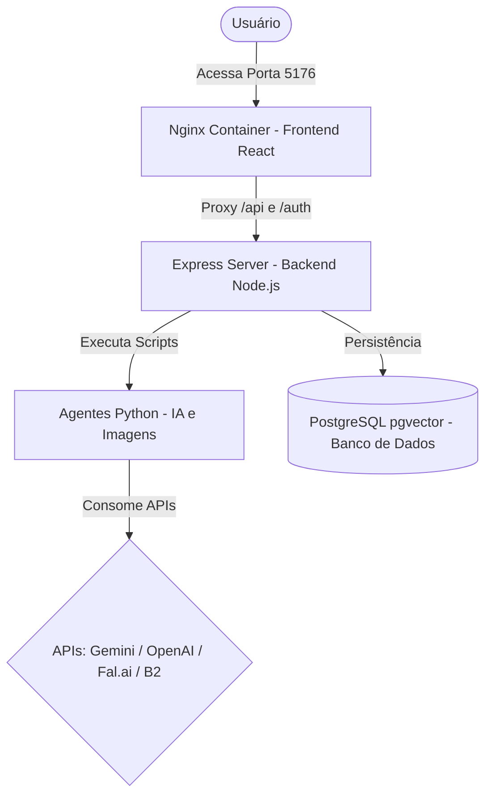

# Oráculo — Dashboard de Produção & IA

O **Oráculo — Manager** é a plataforma central de inteligência e automação para o seu perfil do Instagram. Ele combina um frontend modular em **React + Vite** com um ecossistema robusto em **Node.js (Express)** e **agentes automatizados em Python** para gerar, agendar, otimizar e analisar conteúdos de alta performance de forma semiautomática.

---

## 🔮 Funcionalidades Principais

* **Criador de Carrosséis (IA Chat):** Chat integrado que utiliza modelos de linguagem avançados (Gemini/GPT) adaptados com o tom de voz editorial e regras da sua marca para redigir roteiros completos de 10 slides e iniciar o pipeline automatizado de geração de imagens.
* **Dashboard & Galeria Premium:** Grade de gerenciamento de posts contendo status interativos (*Rascunho*, *Pronto*, *Aprovado*, *Publicado*), controle de custos (USD) de geração de imagens, exportação direta em formato PowerPoint (`.pptx`) e postagem instantânea no Instagram.
* **Clonador de Reels (Engenharia Reversa):** Ferramenta que baixa vídeos do Instagram/TikTok, faz transcrição de áudio, analisa padrões psicológicos e ganchos de retenção e reescreve o roteiro sob a identidade da sua marca.
* **Calendário de Agendamento:** Linha do tempo visual mensal e diária para organizar a fila de postagens aprovadas nos horários nobres de publicação (09h, 13h, 20h).
* **Fábrica de Vídeos:** Pipeline integrado para produzir narrações misteriosas com ElevenLabs e sincronizar com geradores de vídeo de Dark Fantasy (Seedance / Kling / Sora).
* **Radar de Descobertas:** Integração com scrapers do Apify para buscar pesquisas científicas inusitadas, fatos bizarros e teses ocultas para servir de base para novos carrosséis.
* **Painel de Configurações:** Gerenciamento integrado e seguro de chaves de API externas (OpenAI, Fal.ai, Gemini, ElevenLabs, Apify, B2 Storage).

---

## 🛠️ Arquitetura do Projeto

O projeto utiliza uma arquitetura descentralizada orquestrada via **Docker Compose**:



* **Frontend:** Single Page Application (SPA) estruturada em **React + Vite**, estilizada com variáveis CSS personalizadas (Glassmorphism e Neon) e compilada via build multi-stage.
* **Backend:** API RESTful baseada em **Express.js**, responsável por controle de sessão, cookies de segurança, proxies SSE e orquestração de scripts.
* **Agentes Python:** Scripts de automação localizados em `backend/core/` que estruturam os prompts, geram imagens coerentes e gerenciam renderizações de slides.
* **Banco de Dados:** **PostgreSQL com extensão pgvector** para armazenar metadados dos carrosséis, histórico de Reels e métricas de engajamento do Instagram.

---

## 🐳 Como Rodar Localmente (Docker)

Certifique-se de ter o Docker e Docker Compose instalados em sua máquina.

1. **Configuração de Variáveis de Ambiente:**
   Copie as variáveis do arquivo de modelo para o arquivo real e insira suas credenciais:
   ```bash
   cp backend/.env.example .env
   ```

2. **Subir os Containers:**
   Execute o build e a inicialização forçada de cache limpo:
   ```bash
   docker-compose -f docker/docker-compose-local.yml up -d --build --force-recreate
   ```

3. **Portas de Acesso:**
   * **Frontend Dashboard (Nginx):** [http://localhost:5176](http://localhost:5176)
   * **API Backend (Express):** [http://localhost:3131](http://localhost:3131)
   * **Banco de Dados (Postgres):** `localhost:5432`

---

## 🔑 Credenciais de Teste

Para realizar login no dashboard em ambiente de desenvolvimento, utilize as seguintes credenciais padronizadas:

* **E-mail de Login:** `admin@exemplo.com.br`
* **Senha:** `senha_ficticia_123`

---

## 📂 Organização de Diretórios

```text
Oraculo-Manager/
├── backup/                  # Backups históricos dos códigos antigos (HTML puro)
├── docker/                  # Configurações do Nginx, Dockerfiles e docker-compose
├── frontend/                # SPA React + Vite (Código atualizado e modularizado)
│   ├── public/              # Páginas estáticas legadas e assets estáticos
│   ├── src/                 # Código-fonte React (.jsx e css de estilo)
│   │   ├── components/      # Componentes menores e reutilizáveis
│   │   └── css/             # dashboard.css (Design System Premium)
│   └── package.json         # Dependências do frontend
└── backend/                 # API Express.js, Modelos de dados e scripts Python
    ├── core/                # Agentes automatizados, pipelines de IA e utilitários
    ├── dashboard/           # Servidor Express.js (server.js) e banco de dados
    └── tests/               # Scripts de validação e testes unitários do backend
```

---

## 🛡️ Regras de Desenvolvimento e Limites de Código

Para manter o projeto saudável e manutenível por agentes de IA e humanos:
* **Limite do Frontend (React/JSX):** Nenhum arquivo de componente deve ultrapassar **500 linhas** de código.
* **Limite do Backend (Python):** Nenhum script Python deve ultrapassar **1.000 linhas**.
* **Integridade Visual:** Toda mudança nas telas de frontend deve ser verificada por prints visuais.
* **Conventional Commits:** Todas as mensagens de commits devem seguir o padrão (ex: `feat: ...`, `fix: ...`, `style: ...`, `chore: ...`) e ser redigidas em **Português do Brasil**.
